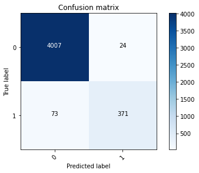

# SVM_Model
Implementation of a **SVM model** using sickit-learn with different kernels, penalty parameters of the error term, and gamma values, and applying **grid search** to optimize the hyperparameters of the model.

The **kernel functions** are used to map the original dataset into a **higher dimensional space** with the view to make it a linear dataset. These kernels are different in case of making the **hyperplane decision boundary** between the classes.

Usually **linear** and **polynomial** kernels are less time consuming and provides less accuracy than the **RBF** or **Gaussian kernels**.

the **linear** kernel works fine if the dataset is linearly separable.

**RBF** uses normal curves around the data points, and sums these so that the decision boundary can be defined by a type of topology condition such as curves where the sum is above a value of 0.5. But, **polynomial** features are derived features from given features in the data set. We require more polynomial features if our dataset is complex, leading to slow model training as the feature increases. 

First, I normalize the data and split it to train and test sets, using sklearn library:

```ruby
from sklearn.model_selection import train_test_split
from sklearn.preprocessing import StandardScaler
```

<h2> &nbsp;Part B</h2>

I implement different SVM models (using SVC.fit), by fixing the kernel as **linear**, and changing the value of **C**.

```ruby
svm_clf = SVC(kernel="linear", C)
```

The results are as follows:

<h3> &nbsp;kernel = linear</h3>

<h4> &nbsp;C = 1</h4>

accuracy = 0.9812290502793296

<h4> &nbsp;C = 100</h4>

accuracy = 0.9812290502793296

<h4> &nbsp;C = 1000</h4>

accuracy = 0.9812290502793296

Then, I implement different SVM models by fixing the kernel as **RBF**, and changing the value of **C**. The results are as follows:

<h4> &nbsp;C = 1</h4>

accuracy = 0.9722905027932961

<h4> &nbsp;C = 100</h4>

accuracy = 0.9787709497206704

<h4> &nbsp;C = 1000</h4>

accuracy = 0.980782122905028

Now, I implement different SVM models by fixing the kernel as **polynomial**, and changing the value of **C**. The results are as follows:

<h4> &nbsp;C = 1</h4>

accuracy = 0.9711731843575419

<h4> &nbsp;C = 100</h4>

accuracy = 0.9769832402234637

Setting the kernel as **sigmoid**, and changing the value of **C**. The results are as follows:

<h4> &nbsp;C = 1</h4>

accuracy = 0.9246927374301676

<h4> &nbsp;C = 100</h4>

accuracy = 0.9217877094972067

As it can be seen from the above implementations, the accuracy of the **linear kernel** is higher than the other kernels, but different values of **C**, didn't have much effect on the accuracy of the linear kernels.

<h2> &nbsp;Part C</h2>

Now, I implement a **grid search** algorithm to optimize my SVM model weights, using the sklearn library as below:

```ruby
from sklearn.model_selection import GridSearchCV
parameters = {'kernel': ['poly'], 'degree': [2, 3, 4], 'C':[1, 10, 100, 500], 'gamma':[0.01, 0.03, 0.05]}
clf = GridSearchCV(svc, parameters)
```

<h4> &nbsp;Grid Search on Linear kernel:</h4>

Best Estimator: SVC(C=10, gamma=0.9, kernel='linear')

Best Score: 0.9788423293286377

<h4> &nbsp;Grid Search on RBF kernel:</h4>

Best Estimator: SVC(C=10)

Best Score: 0.9792147965597916

<h4> &nbsp;Grid Search on Polynomial kernel:</h4>

Best Estimator: SVC(C=500, gamma=0.05, kernel='poly')

Best Score: 0.9776503009766128

As it can be seen in this part, the maximum accuracy belongs to the **RBF** kernel with C=10.

Now, I define a function for implementing the **confusion matrix**: from sklearn.metrics import confusion_matrix

Plotting the confusion matrix for best estimator of **Part B**:


Plotting the confusion matrix for best estimator of **Part C**:



As it is shown in the results, the confusion matrices are very similar in these 2 cases, and the confusion matrix for the best estimator of part B, is a little bit better than that of part B. 
